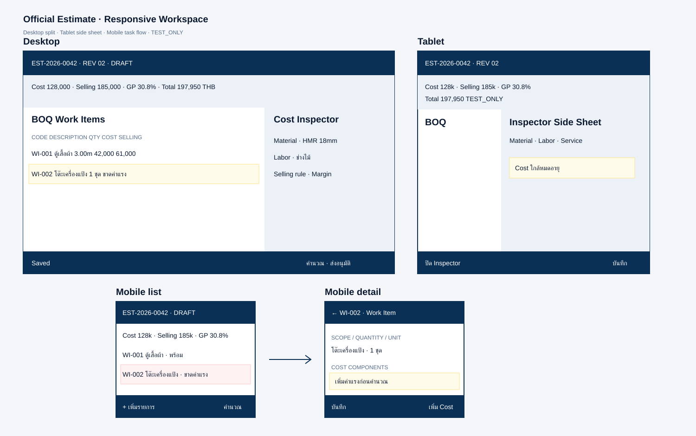

# Official Estimate Responsive Wireframe (โครงหน้าจอประมาณการทางการ)

**สถานะ:** Accepted Direction — UX Baseline สำหรับ Desktop, Tablet และ Mobile

## เป้าหมาย

ให้ Estimator สร้าง BOQ ตรวจต้นทุน ราคาขาย กำไร และส่งอนุมัติได้ด้วย Information Architecture เดียวกันทุกอุปกรณ์ โดยไม่บังคับผ่าน Quick Estimate



ภาพเป็น Low-fidelity Wireframe ตัวเลขทั้งหมดเป็น `TEST_ONLY`

## Responsive Model

| Context | Layout | งานหลัก |
| --- | --- | --- |
| Desktop ≥1200px | BOQ Table ซ้าย + Cost Inspector ขวา | ทำและตรวจหลายรายการต่อเนื่อง |
| Tablet 768–1199px | BOQ เต็มพื้นที่ + Inspector Side Sheet | ตรวจทีละรายการโดยยังเห็นบริบท |
| Mobile 320–767px | Work Item List → Detail แบบ Task-focused | เพิ่ม/แก้รายการนอกโต๊ะทำงาน |

Breakpoint ใช้จุดที่เนื้อหาเริ่มอ่านยาก ไม่อิงชื่ออุปกรณ์อย่างเดียว

## Desktop Workspace

```text
Title/Revision/Customer/Status
Financial HUD: Cost | Selling | GP% | Discount | Tax | Grand Total
┌──────────────────────────────┬─────────────────────┐
│ Section + BOQ Work Item Table│ Cost Inspector      │
│ Code/Description/Qty/Unit    │ Material/Labor      │
│ Cost/Selling/GP/Exceptions   │ Selling Rule/Audit  │
└──────────────────────────────┴─────────────────────┘
Sticky Command: Save | Calculate | Submit/Approve/Return
```

- Table รองรับ Search, Filter, Sort, Multi-select และ Keyboard Row Navigation
- Inspector แก้ Work Item ที่เลือกโดยไม่ใช้ Modal สำหรับงานยาว
- HUD แสดง Snapshot ล่าสุดและติดป้าย `Outdated` เมื่อ Draft เปลี่ยน
- ตรึง Code/Description และแสดง Money แบบ Tabular Number

## Tablet Workspace

- Landscape ใช้ BOQ 2/3 และ Inspector 1/3 เมื่อพื้นที่พอ
- Portrait ใช้ BOQ เต็มพื้นที่; Inspector เป็น Side Sheet ≤85% และคืน Focus ไปแถวเดิมเมื่อปิด
- Column หลักคือ Description, Quantity/Unit, Cost, Selling และ Status
- Financial HUD เรียง 2 แถว ห้ามซ่อน Total/Margin หรือบังคับเลื่อนแนวนอนเพื่อเห็นยอดสำคัญ

## Mobile Workspace

```text
EST-2026-0042 · Rev 02 · Draft
Cost 128,000 | Selling 185,000 | GP 30.8% TEST_ONLY
[ค้นหา] [Section] [Exception]

WI-001 ตู้เสื้อผ้า      3.00 m   พร้อม
WI-002 โต๊ะเครื่องแป้ง  1 ชุด    ขาดค่าแรง

[+ เพิ่ม Work Item]              [คำนวณ]
```

Work Item Detail เรียง Scope → Quantity/Unit → Cost Components → Selling Rule → Discount/Tax Exception → Result Mobile ไม่ใช้ Desktop Table ย่อส่วนและไม่ซ่อนความเสี่ยงทางการเงินหลังเมนู

## Screen and Action Contract

| Screen/Panel | Primary Action | API Intent |
| --- | --- | --- |
| Estimate List | สร้าง Estimate | Create Draft |
| Estimate Workspace | บันทึก/คำนวณ | Patch Draft / Calculate |
| Work Item Detail | บันทึกรายการ | Patch Draft Work Item |
| Cost Inspector | เพิ่ม/แก้ Cost Component | Patch Draft Cost Component |
| Validation Summary | ไปจุดผิด/คำนวณใหม่ | Calculate |
| Approval Review | Submit/Approve/Return | Business Transition |
| Revision Compare | สร้าง Revision | Clone immutable source to Draft |
| Quotation Readiness | ออกใบเสนอราคา | Issue from Approved Revision |

## UI States

| State | การแสดงผล | Action |
| --- | --- | --- |
| Empty | ต้องเพิ่ม Section/Work Item | เพิ่มรายการแรก |
| Dirty/Saving/Saved | Save State + เวลา | Autosave Draft |
| Calculation Outdated | Banner เหนือ HUD | คำนวณใหม่ก่อน Submit |
| Validation Error | Summary + Error ใต้ Field/Cell | Focus จุดแรกที่ผิด |
| Missing/Stale Cost | Exception ที่ Work Item/HUD | เพิ่มหรือยืนยัน Cost Source |
| Low Margin/High Discount | แสดง Trigger ไม่เผย Threshold เกินสิทธิ์ | ส่ง Approval Route |
| Conflict | Compare Server/Local | ไม่ Merge Financial Result อัตโนมัติ |
| Submitted | Read-only สำหรับ Maker | รอ Reviewer/Withdraw ตาม Policy |
| Approved/Quoted | Immutable | สร้าง Revision ใหม่ |

## Approval UX

- Reviewer เห็น Revision Diff, Total, Margin/Markup, Discount, Tax และ Exception ก่อนตัดสิน
- Approve/Return มี Confirmation; Return บังคับ Reason และจุดที่ต้องแก้
- Maker–Checker Error บอกให้ผู้ตรวจคนอื่นดำเนินการ
- Frontend ซ่อน Action ที่ไม่มีสิทธิ์ แต่ Backend ยังตรวจทุกคำสั่ง

## Accessibility

- Touch Target ≥44×44px, Mobile Input ≥48px และ Body Text Mobile ≥16px
- Table มี Header/Caption/Row Selection ที่ Screen Reader เข้าใจ
- Side Sheet จัด Focus, Escape ปิด และคืน Focus ให้ Trigger
- Status ไม่ใช้สีอย่างเดียว; รองรับ 320px, Landscape, Zoom 200%, ไทย/อังกฤษ และ Reduced Motion

## Source Documents

- [Estimation Flow](estimation-flow.md)
- [Estimation Calculation Rules](estimation-calculation-rules.md)
- [Approval Matrix](approval-matrix.md)
- [Official Estimate API Contract](../03-contracts/official-estimate-api-contract.md)
- [Official Estimate Data Contract](../04-data/official-estimate-data-contract.md)
