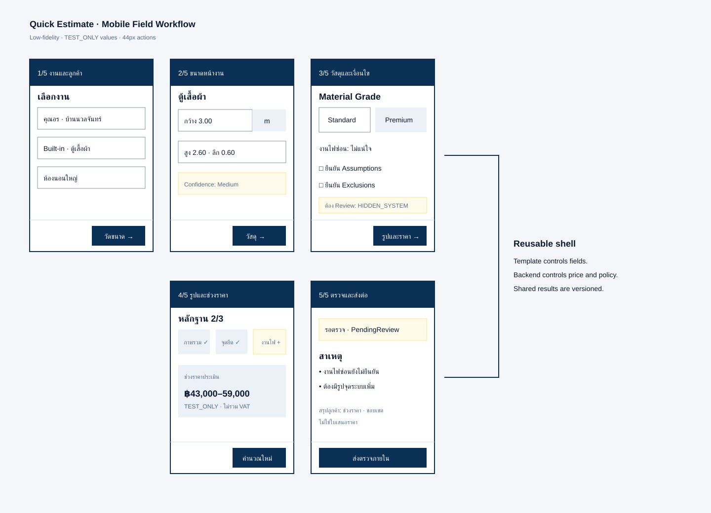

# Quick Estimate Mobile Wireframe (โครงหน้าจอมือถือ)

**สถานะ:** Accepted Direction — ใช้เป็น UX Baseline ก่อนสร้าง Frontend Prototype

## เป้าหมาย

ช่วย Field Estimator เก็บข้อมูลและแจ้งช่วงราคาเบื้องต้นที่หน้างานได้เร็วด้วย Wizard 5 ขั้น Field เปลี่ยนตาม Pricing Template แต่ Navigation, Validation, Save State และ Share Policy ใช้มาตรฐานเดียวกัน



ภาพเป็น Low-fidelity Wireframe เพื่อกำหนดโครงสร้างและลำดับงาน ไม่ใช่หน้าตา Production ขั้นสุดท้าย

## ลำดับอ่านแบบข้อความ

```text
งานและลูกค้า → ขนาดหน้างาน → วัสดุและเงื่อนไข
              → รูปและช่วงราคา → ตรวจและส่งต่อ
```

ทุกจอมี Header ระบุลูกค้า/พื้นที่, Step Indicator, Save Status และ Sticky Bottom Action ปุ่ม Back ต้องไม่ทำข้อมูลหาย

## Screen Contract

| Step | Screen Key | งานของผู้ใช้ | Primary Action | ผลลัพธ์ |
| ---: | --- | --- | --- | --- |
| 1 | `job` | เลือกลูกค้า Opportunity สถานที่ ห้อง ประเภทงาน และ Template | ถัดไป: วัดขนาด | Draft มี Context/Template |
| 2 | `measurements` | กรอก Measurement Line, Unit และ Confidence | ถัดไป: วัสดุ | Input ผ่าน Measurement Validation |
| 3 | `options` | เลือก Material Grade/Option ตอบ Complexity และยืนยัน Assumption/Exclusion | ถัดไป: รูปและราคา | Rule Input ครบ |
| 4 | `evidence-price` | ถ่ายรูปให้ครบแล้วสั่ง Calculate | คำนวณช่วงราคา | Server Snapshot + Share Decision |
| 5 | `review-share` | แก้ Blocker, ส่ง Review หรือ Share/Convert ตาม Policy | ส่งตรวจ/แชร์/ทำราคาทางการ | Versioned Outcome |

## Step 1 — งานและลูกค้า

Field เรียงเป็น Customer, Opportunity, Property Type, Room/Area, Work Type และ Effective Pricing Template Version

- แสดง Recent Customer ก่อน Search เพื่อลดการพิมพ์
- เปลี่ยน Work Type แล้วต้อง Preview ข้อมูลที่จะถูก Reset ก่อนยืนยัน
- Template `Calibration` ต้องแสดงว่าทุกการ Share ต้อง Review
- Resource นอก Scope ไม่ปรากฏในตัวเลือก

## Step 2 — ขนาดหน้างาน

- Numeric Input ใช้แป้น Decimal; Quantity ใช้แป้นจำนวนเต็ม
- Unit อยู่ติด Input และเปลี่ยนได้เฉพาะค่าที่ Template อนุญาต
- Measurement Line เพิ่ม คัดลอก และลบได้; Undo ได้ก่อน Autosave รอบถัดไป
- แสดง Billable Quantity Preview แต่ระบุว่า Server เป็นผู้คำนวณราคา
- บังคับ `measurementConfidence` เป็น High/Medium/Low พร้อมคำอธิบายผลต่อช่วงราคา

```text
ตู้เสื้อผ้า · ห้องนอนใหญ่
กว้าง 3.00 m · สูง 2.60 m · ลึก 0.60 m · 1 ชุด
Confidence: Medium — ต้องยืนยันก่อนราคาทางการ
```

## Step 3 — วัสดุและเงื่อนไข

- Material Grade แสดงชื่อไทยและผล เช่น “ช่วงราคาสูงขึ้น” แต่ไม่เผย Internal Factor
- แสดง Option เฉพาะ Template เช่น Door, Drawer, Track, Lining หรือ Pattern
- Complexity ใช้ Yes/No/Unknown และบอกว่าเพิ่ม Risk, Add-on หรือ Review
- Assumption/Exclusion ใช้ Default ได้ แต่ผู้ใช้ต้องยืนยันก่อน Share
- Custom Material ไม่มี Approved Provisional Rate ต้อง Block

## Step 4 — รูปและช่วงราคา

Evidence Slot มีสถานะ `ยังขาด`, `กำลังอัปโหลด`, `สำเร็จ` หรือ `อัปโหลดไม่สำเร็จ` หลัง Calculate Server ต้องคืน Displayed Range, Currency, Tax Policy, Validity, Assumption/Exclusion, Share Decision และ Reason Code

ห้ามแสดงค่ากลางเป็นราคาที่แนะนำ และห้ามทำ Animation ตัวเลขที่สื่อความแม่นยำเกินจริง

## Step 5 — ตรวจและส่งต่อ

| Decision | Primary Action | Secondary Action |
| --- | --- | --- |
| `Blocked` | กลับไปแก้จุดที่ขาด | บันทึก Draft |
| `PendingReview` | ส่งตรวจภายใน | ดูเหตุผล/แก้ข้อมูล |
| `Shareable` | แสดงหรือส่งสรุปเบื้องต้น | ดูรายละเอียดก่อนแชร์ |
| `Shared` | บันทึกผลตอบรับ | สร้าง Official Estimate Draft |

ก่อน Share ต้องยืนยันผู้รับ, Version, ช่วงราคา, Validity, Tax Notice และข้อความ “ไม่ใช่ใบเสนอราคา”

## Sticky Mobile Shell

```text
┌──────────────────────────┐
│ ← Quick Estimate   Saved │
│ ลูกค้า · ห้อง · งาน       │
├──────────────────────────┤
│ 1 ━ 2 ━ 3 ━ 4 ━ 5       │
│                          │
│ Scrollable Step Content  │
│                          │
├──────────────────────────┤
│ ฿43,000–59,000 TEST_ONLY │
│ [ย้อนกลับ] [Action หลัก] │
└──────────────────────────┘
```

## Save และ Network States

| State | ข้อความ | พฤติกรรม |
| --- | --- | --- |
| `dirty` | ยังไม่บันทึก | Debounce Autosave; เตือนก่อนปิด |
| `saving` | กำลังบันทึก… | กัน Submit ซ้ำ แต่ยังแก้ Field อื่นได้ |
| `saved` | บันทึกแล้ว 14:32 | แสดงเวลาท้องถิ่น; Server เก็บ UTC |
| `offline-draft` | ออฟไลน์ — เก็บในเครื่องชั่วคราว | แก้ Draft ได้; Calculate/Share ไม่ได้ |
| `syncing` | กำลังส่งข้อมูลที่ค้าง | ส่งตาม Version และหยุดเมื่อ Conflict |
| `conflict` | มีข้อมูลรุ่นใหม่กว่า | Reload/Compare; ไม่ Merge ราคาอัตโนมัติ |

Offline Draft ต้องเข้ารหัส มี Expiry และไม่เก็บรูป/ข้อมูลส่วนบุคคลเกินจำเป็น Release แรกไม่รองรับแก้ Draft เดียวกันแบบ Offline หลายอุปกรณ์

## Loading, Empty และ Error

- Template กำลังโหลดใช้ Skeleton พร้อมข้อความ; Template ว่างบอกสาเหตุและทางติดต่อผู้ดูแลราคา
- Field Error อยู่ใต้ Field และมี Error Summary ด้านบน Step
- System Error แสดง Trace ID และ Retry โดยไม่ล้าง Draft
- Upload Error Retry เฉพาะไฟล์ที่ล้มเหลว
- Permission เปลี่ยนระหว่างเปิดหน้าให้หยุด Action ที่ไม่ได้รับอนุญาต

## Accessibility และ Mobile Constraints

- รองรับ 320px โดยไม่มี Horizontal Scroll ใน Form
- Touch Target ขั้นต่ำ 44×44px และ Input สำคัญสูงอย่างน้อย 48px
- Label อยู่เหนือ Field; Placeholder ไม่ใช้แทน Label
- Focus Order ตามภาพและ Focus Error แรกหลัง Submit
- Step Indicator มีชื่อ ไม่สื่อด้วยเลขหรือสีอย่างเดียว
- รูปมี Alt/Caption และปุ่มถ่ายใหม่ระบุชื่อ Slot
- รองรับ Text Zoom 200%, ไทย/อังกฤษ และ Reduced Motion

## Mapping ไปยังเอกสารหลัก

- Field: [Quick Estimate Template Catalog](quick-estimate-template-catalog.md)
- Formula/Decision: [Quick Estimate Pricing Rules](quick-estimate-pricing-rules.md)
- Governance: [Pricing Template Governance](pricing-template-governance.md)
- API: [Quick Estimate API Contract](../03-contracts/quick-estimate-api-contract.md)
- Data: [Quick Estimate Data Contract](../04-data/quick-estimate-data-contract.md)
